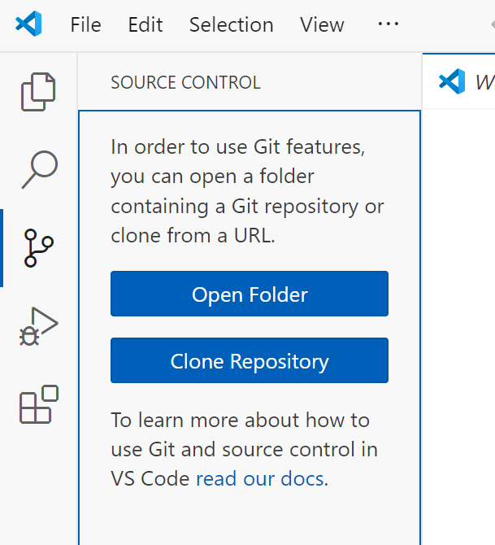
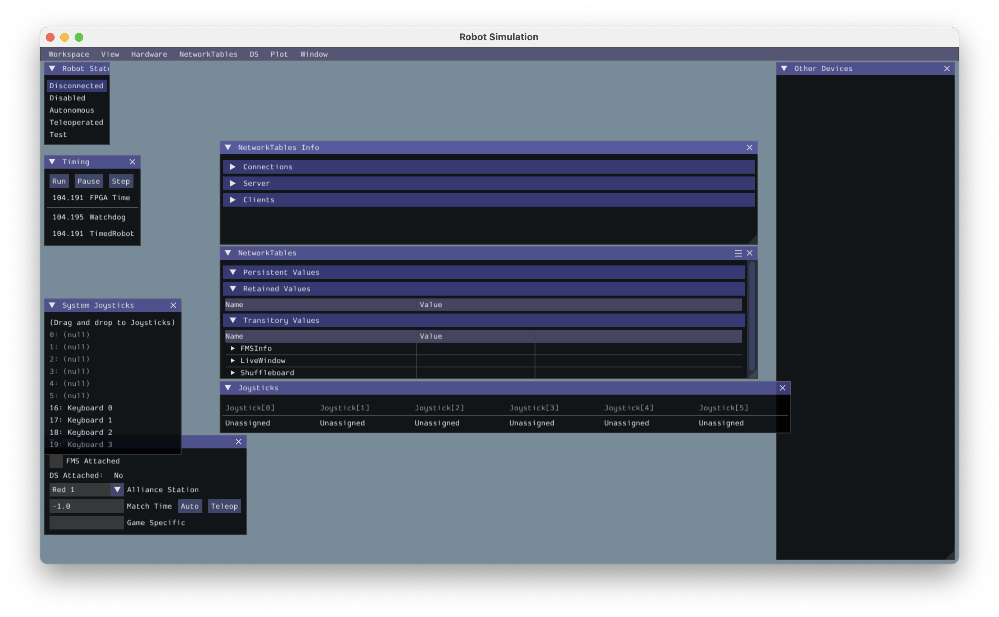

# Install prerequisites 

- [Install Python 3.13 on your development computer(s)](https://www.python.org/downloads/)
- [Install VSCode on your development computer(s)](https://code.visualstudio.com/download)
- [Install Git for Windows on your development computers](https://git-scm.com/downloads)
- [Install FRC Game and RobotPy on your dev computer(s)](https://docs.wpilib.org/en/stable/docs/zero-to-robot/step-2/frc-game-tools.html)

# Clone this repository and set up virtual environment

- In a browser, go to the FRC2025 repository on GitHub.com (you are probably already
there), click on the green "Code" button, and copy the URL to the repository. 


- In VSCode with nothing open, go to the source control tab (the little branching
icon on the left, shown in the image), and click "Clone Repository".  Paste the URL
you copied into the window at the top. 



- Set the destination as the computer's desktop.  VSCode, using git, will make a copy
of the repository to a folder on the desktop called "FRC2025".
- Open a command prompt (Windows button, type "cmd").
- `cd Desktop\FRC2025` to change directory/folder to the new folder.
- `python -m venv .venv` this creates a "virtual environment" folder named `.venv`
in FRC2025.
- Close the command prompt.
- Open the FRC2025 folder and double-click on the `Start Command Prompt.bat` batch file.
This should open a new command prompt, and it will have the virtual environment
activated.  You can tell this because the beginning text of the prompt will be "(.venv)".
You might want to make a shortcut to this batch file on the desktop, because you will
be using this virtual environment prompt for much of your work.

# Set up robotpy

- In that virtual environment command prompt, type `pip install robotpy`, which
will install the basic robotpy components.
- Then type `robotpy sync`.  This will download any other dependencies, using the
`pyproject.toml file` as a reference.  As we develop code over the season, we will
sometimes make changes to this file, and you will have to run `robotpy sync` again.


# Check Installation

- Open a terminal using the `Start Command Prompt.bat` batch file.
- Run `robotpy --main src/hello_robot/hello_robot.py sim`

You should see the simulation window:



And in your console you should see something like:

```
10:01:35:647 INFO    : faulthandler        : registered SIGUSR2 for PID 2744
10:01:35:649 INFO    : halsim_gui          : WPILib HAL Simulation 2024.3.2.1
HAL Extensions: Attempting to load: libhalsim_gui
Simulator GUI Initializing.
Simulator GUI Initialized!
HAL Extensions: Successfully loaded extension
10:01:35:767 WARNING : pyfrc.physics       : Cannot enable physics support, /Users/lobrien/Documents/src/FRC/FRC2025/src/hello_robot/physics.py not found
10:01:35:768 INFO    : wpilib              : RobotPy version 2024.3.2.2
10:01:35:768 INFO    : wpilib              : WPILib version 2024.3.2.1
10:01:35:768 INFO    : wpilib              : Running with simulated HAL.
10:01:35:770 INFO    : nt                  : could not open persistent file 'networktables.json': No such file or directory (this can be ignored if you aren't expecting persistent values)
10:01:35:771 INFO    : nt                  : Listening on NT3 port 1735, NT4 port 5810
Not loading CameraServerShared
Success

********** Robot program startup complete **********
2024-12-24 10:01:35.791 Python[2744:71983881] +[IMKClient subclass]: chose IMKClient_Modern
2024-12-24 10:01:35.791 Python[2744:71983881] +[IMKInputSession subclass]: chose IMKInputSession_Modern
Default DisabledPeriodic() method... Override me!
Default RobotPeriodic() method... Override me!
Default SimulationPeriodic() method... Override me!

```
Close the simulation GUI window to stop the simulation. Congratulations! You have successfully installed the FRC tools and dependencies for this project.


### Troubleshooting Installation

If you do not see the simulation window, or if you see an error message, please check the following:

- Were you in a command prompt window with an activated virtual environment before running `robotpy`?

If you see an error message like `command not found: robotpy`, then you may need to install the `robotpy` command line tool.

- Did you run `robotpy` from the root directory of this repository?

If you see an error message like `ERROR: /src/hello_robot/hello_robot.py does not exist`, then you may not be in the root directory of this repository.

    - If you are running a Windows Command or Powershell prompt, check which directory you are in by running `dir`. 
    - If you are running a Unix shell, check which directory you are in by running `pwd`.

- Did you see any error messages when you ran either `pip install robotpy` or `robotpy sync`?

If you see an error message like `ERROR: Could not find a version that satisfies the requirement ...`, then you may have a network connectivity issue. 

    - Check your network connection

- Did you see any error messages when you ran `poetry shell`?

- Did you see any error messages when you ran `robotpy`?

You should install the `robotpy` command-line tool while installing the FRC wpilib tools on this machine. 

