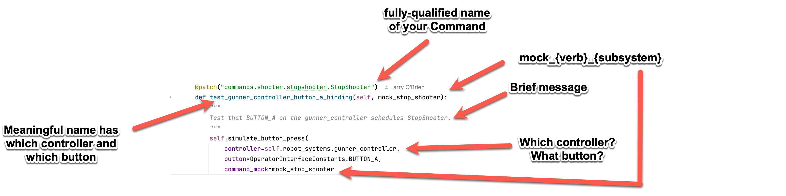

# Recipe for creating new Commands

## Overview

Commands are the building blocks of the robot's behavior. They are small pieces of code that perform a specific task. 
For example, an `IdleShooterCommand` class might be responsible for putting the flywheel in it's resting state
(perhaps stopped or perhaps spinning slowly). 

## Steps

1. Determine which subsystem the new command primarily works on. When you send this command, what is it logically doing?
Which subsystem do you think about? For example, if you think "I want to stop the shooter", then the command belongs to 
the `Shooter` subsystem." If you can't think of a subsystem that the command belongs to, then maybe the behavior should 
be a utility function in the `utilities` directory rather than a command.
2. Create a new Python file in the `commands/{subsystem}` directory. The file name should be the name of the command, with the word 
`Command` appended to the end. For example, `commands/shooter/IdleShooterCommand.py`.
2. Create a new class in the file. The class should inherit from the `Command` class.
3. In the class, implement the `__init__` method. In this method, you should call the `requires` method and pass in the
3. Implement the `initialize`, `execute`, `isFinished`, and `end` methods. 
4. If the new command is a default command for a subsystem, add it to the subsystem's `default_command` attribute in the
`RobotSystems` class.

## Example

1. Q: To which subsystem should we send this Command? "We want to fully stop the **shooter**."  A: (The `Shooter` subsystem)
2. Design the Command's state machine for the desired behavior "We want this command to wait
until the shooter is fully stopped. Only then is the command truly over. We want to track the shooter's RPM as it 
slows.":
   - **Initialize**: When the command is first called, it should start stopping the shooter.
   - **Execute**: The command should log the current RPM of the shooter's motors as it slows.
   - **IsFinished**: Are all the shooter's motors fully stopped?
   - **End**: The command should log that the shooter has stopped.

3. In the `commands/shooter` directory, create a new file called `stopshootercommand.py` This file should be named using lower-
case, not SnakeCase.
3. In the file, create a new class called `StopShooterCommand` that inherits from `Command`. Import any modules that
you need. (For example, `datetime` for logging the current time.)

For the following steps, you can refer to the [command template](../src/sharkbot/commands/command_template.txt) for a template.
4. In the class, implement the `__init__` method. In this method, you should call the `requires` method and pass in the
   `Shooter` subsystem. You should also create a logger object using the `NTLoggerUtility` class.
```python
from commands2 import Command
from datetime import datetime

from util.ntloggerutility import NTLoggerUtility

class StopShooter(Command):
    def __init__(self, shooter):
        """
               Command to stop the shooter subsystem.
        """
        super().__init__()
        self.shooter = shooter
        self.logger = NTLoggerUtility("ShooterLogs")
        self.addRequirements(shooter)
```

5. Implement the `initialize`, `execute`, `isFinished`, and `end` methods that we designed earlier. Implement any 
additional methods that you might need. For example, if you want to add timestamps to your log messages, you might want
to create a `getTimestamp` method that returns the current time in a specific format. (Would this method be better 
located in a utility class? Probably!) (Notice that we use different log levels for different messages. We probably 
always to log when the command starts and ends, but we only want to log the shooter's RPM when we're debugging the )
```python
    def getTimestamp(self):
        return datetime.now().strftime("%H:%M:%S")

    def initialize(self):
        timestamp = self.getTimestamp()
        msg = f"[%{timestamp}] StopShooterCommand: Stopping shooter"
        self.logger.info("Command", msg)
        self.shooter.stop()

    def execute(self):
        timestamp = self.getTimestamp()
        msg = f"[%{timestamp}] Shooter flywheel RPM: {self.shooter.getFlywheelRpm()} \
        Gate status: {self.shooter.getGateStatus()}"
        self.logger.debug("Command", msg)

    def isFinished(self):
        flywheelRpm = self.shooter.getFlywheelRpm()
        gateStatus = self.shooter.getGateStatus()
        if flywheelRpm == 0 and gateStatus == "closed":
            return True
        else:
            return False

    def end(self):
        timestamp = self.getTimestamp()
        msg = f"[%{timestamp}] StopShooterCommand: Shooter stopped"
        self.logger.info("Command", msg)
```

6. If necessary, add the relevant hardware-related methods to the `Shooter` subsystem. For example, you might need to add
a `stop` method to the `Shooter` class. 
```python
    def stop(self):
        self.flywheelMotor.stop()
        self.gate.close()

    def getFlywheelRpm(self):
        return self.flywheelMotor.getRpm()

    def getGateStatus(self):
        return self.gate.getStatus()
```

8. Implement the test for the binding of the command to the control system. Open 
**tests/testcontrollerbindings.py** file and add a new test using this template:




```python
@patch("commands.shooter.stopshooter.StopShooter")
 def test_operator_controller_button_a_binding(self, mock_stop_shooter):
     """
     Test that BUTTON_A on the operator_controller schedules StopShooter.
     """
     self.simulate_button_press(
         controller=self.robot_systems.operator_controller,
         button=OperatorInterfaceConstants.BUTTON_A,
         command_mock=mock_stop_shooter
     )
```
7. ADVANCED!!!: Implement tests for the new command in the `tests` directory (See [Test Recipe](NewTestRecipe.md#Command)). 
For example, see **tests/test_stopshootercommand**. 

