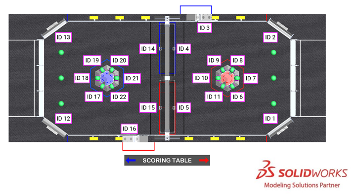

# Robot Localization with Limelight MegaTag2

Foundation document: [Robot Localization with MegaTag2 | Limelight Documentation](https://docs.limelightvision.io/docs/docs-limelight/pipeline-apriltag/apriltag-robot-localization-megatag2

Step 1: Access limelight via Web interface

Try http://10.38.81.11

If no answer, work through: [Limelight 3 Quick-Start | Limelight Documentation](https://docs.limelightvision.io/docs/docs-limelight/getting-started/limelight-3#3-accessing-the-web-interface) (or whichever model Limelight we have)

From MegaTag2 page:

* [ ] Your limelight's robot-space pose has been configured in the webUI or via the API

  ​	I think this means that you have to specify the offset of the limelight from the origin of your robot. I think we can leave these as [0,0,0] until the limelight's mounting position on the robot is finalized. **Caution:** This is likely to take some trial and error to get accurate enough for aligning with reef. We might need to create at least 2 sides of a reef with accurate dimensions and place apriltags appropriately. (For instance, maybe IDs 9 & 10 or IDs 10 & 11) . AprilTags for reef must be 6.5" square (black area) / 8.125" with white boarder (see Figure 5-23 at [FRC manual arena](https://www.frcmanual.com/2025/arena) )

  

  - [ ] A field map (.fmap) has been uploaded
    1. Follow instructions at [Limelight: How upload .fmap? - Technical - Chief Delphi](https://www.chiefdelphi.com/t/limelight-how-upload-fmap/451120)
    2. Upload `src/robot/deploy/2025-reefscape-welded.json` (source: [JSON Reefscape](https://github.com/wpilibsuite/allwpilib/blob/main/apriltag/src/main/native/resources/edu/wpi/first/apriltag/2025-reefscape-welded.json))
    
  - [ ] `LimelighHelpers.SetRobotOrientation(robotYawInDegrees, 0,0,0,0)` is called every frame in robot-side code
  
    See `VisionSubystem._limelight_periodic` robotpy does not have `SetRobotOrientation` but I think `update_robot_position` is equivalent
  
  - [ ] "SetRobotOrientation assumes a centered (see the map generator) or blue-corner origin. CCW-positive, 0 degrees -> facing red alliance wall in FRC."
  
    We'll have to think about this: is one more aligned with the use of the AprilTag field map? 
  
    I _think_ we want blue-corner origin because from MegaTag2 doc: "For 2024 and beyond, the origin of your coordinate system should always be the "blue" origin. FRC teams should always use botpose_orb_wpiblue for pose-related functionality"
  

## Initial Limelight code

The sample limelight code at the above page works closely with the drive subsystem's odometry. This strongly suggests that instead of having vision be a separate subsystem, we treat it more like the `gyro` in the drive subsystem. I've submitted code that does that at: [Moved vision into drivesubsystem due to odometry interaction by lobrien · Pull Request #5 · WHEARobotics/FRC2025](https://github.com/WHEARobotics/FRC2025/pull/5)

## Notes:

According to [TeamUpdate12.pdf](https://firstfrc.blob.core.windows.net/frc2025/Manual/TeamUpdates/TeamUpdate12.pdf), United States matches will use the **Welded** field perimeter locations for the AprilTags. These are available in [CSV Reefscape](https://github.com/wpilibsuite/allwpilib/blob/main/apriltag/src/main/native/resources/edu/wpi/first/apriltag/2025-reefscape-welded.csv) and [JSON Reefscape](https://github.com/wpilibsuite/allwpilib/blob/main/apriltag/src/main/native/resources/edu/wpi/first/apriltag/2025-reefscape-welded.json)